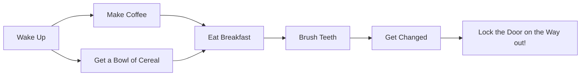
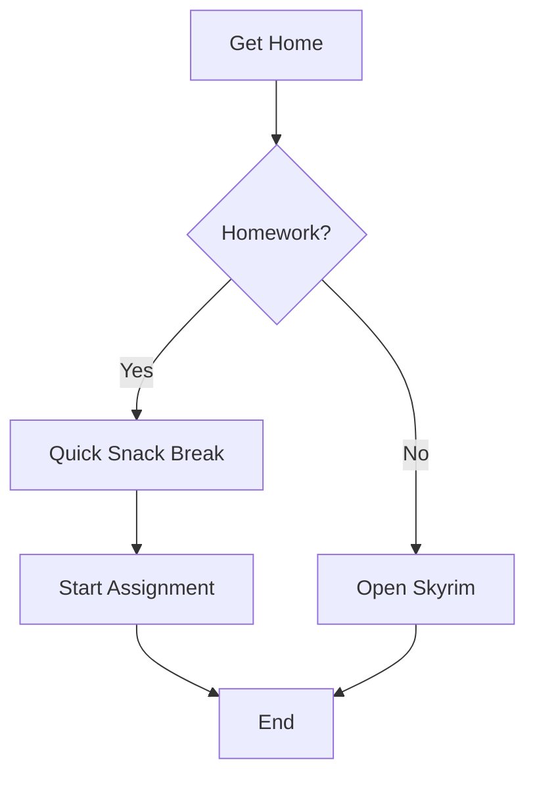
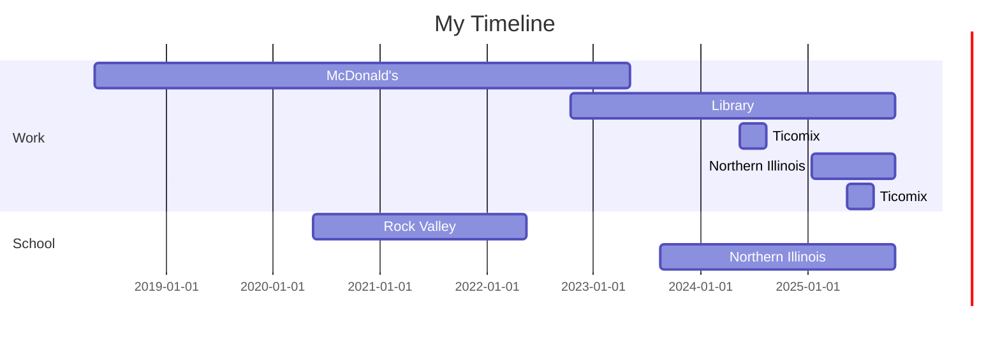
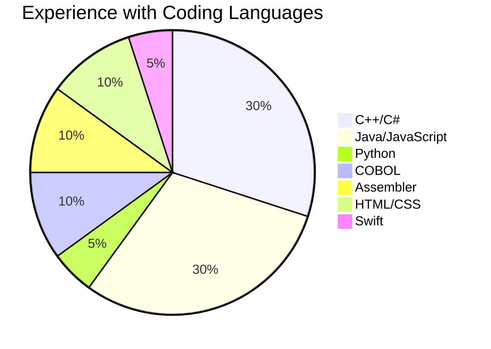

```mermaid
graph LR
    A[Wake Up] --> B[Make Coffee]
    A --> C[Get a Bowl of Cereal]
    B --> D[Eat Breakfast]
    C --> D
    D --> E[Brush Teeth]
    E --> F[Get Changed]
    F --> G[Lock the Door on the Way out!]
```

```mermaid
graph TD
    A[Get Home] --> B{Homework?}
    B -->|No| D[Open Skyrim]
    B -->|Yes| C[Quick Snack Break]
    C --> E[Start Assignment]
    E --> F[End]
    D --> F
```

```mermaid
gantt
    title My Timeline
    dateFormat YYYY-MM-DD
    section Work
    McDonald's          :2018-05-01, 2023-05-04
    Library             :2022-10-15, 2025-10-28
    Ticomix             :2024-05-15, 2024-08-15
    Northern Illinois   :2025-01-15, 2025-10-28
    Ticomix             :2025-05-15, 2025-08-15
    section School
    Rock Valley         :2020-05-15, 2022-05-15
    Northern Illinois   :2023-08-15, 2025-10-28
```

```mermaid
pie title Experience with Coding Languages
    "C++/C#" : 30
    "Java/JavaScript" : 30
    "Python" : 5
    "COBOL" : 10
    "Assembler" : 10
    "HTML/CSS" : 10
    "Swift" : 5
```
